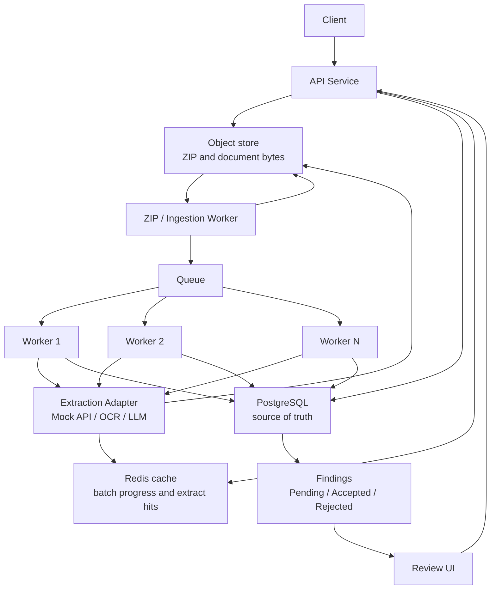
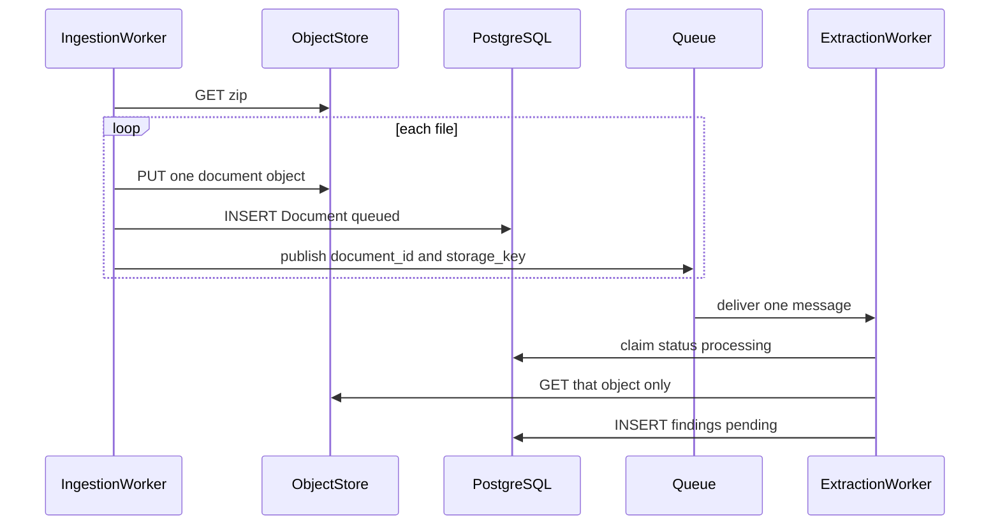

# Future Scope — Large-Scale Production

This document describes how the current assignment system would evolve. **None of this is implemented.** It is a growth map from the seams that already exist: `ExtractionClient`, `StorageBackend`, document-queue claims, repositories, and thin controllers.

Target: tens of thousands of documents per hour, multiple API instances, durable processing, real extractors, and human review at team scale.


## Current limits that force the change

| Area | v1 | Why it breaks in production |
|---|---|---|
| Compute | One Uvicorn process, in-process poller | Cannot scale ingest and extract independently; restart drops in-flight work |
| Queue | `SELECT` + `UPDATE ... WHERE status=queued` on SQLite | Writer lock, no visibility timeout, stale `processing` rows |
| Storage | Local disk `storage/{batch_id}/` | Not shared across hosts; no lifecycle or encryption |
| Database | SQLite | No concurrent writers, no replicas, no point-in-time recovery |
| Ingest | Whole ZIP in memory | 1,000 × 15 MB ≈ 15 GB RAM per request |
| Extractor | Mock, no retries | Real OCR/LLM is slow, rate-limited, and flaky |
| Review | Poll + no auth | No roles, no audit, no push when a batch is ready |
| Ops | No metrics/tracing | Cannot SLO extract latency or find poison documents |


## Coverage checklist

| Requirement | Where it is specified |
|---|---|
| Real document extraction or OCR providers | [Real document extraction or OCR](#real-document-extraction-or-ocr) |
| Editing extracted findings | [Editing extracted findings](#editing-extracted-findings) |
| Multiple reviewers and user roles | [Multiple reviewers and user roles](#multiple-reviewers-and-user-roles) |
| Persistent object storage | [Persistent object storage](#persistent-object-storage) |
| Higher processing volumes | [Higher processing volumes](#higher-processing-volumes) |
| Distributed workers | [Distributed workers](#distributed-workers) |
| Additional document formats and extraction rules | [Additional document formats and extraction rules](#additional-document-formats-and-extraction-rules) |

Keep the **domain model** (`Batch` → `Document` → `Finding`) and the **HTTP resource shape**. Replace the infrastructure behind repositories and protocols.

## Target architecture

This is the production shape. The API accepts the upload and returns. File bytes live in object storage. Postgres is the source of truth for batches, documents, and findings. Redis caches the two reads that would otherwise hammer Postgres and the OCR/LLM providers. A separate ingestion worker unpacks the ZIP. Extraction workers pull from a queue and call one adapter.



| Component | Responsibility |
|---|---|
| **Client** | Uploads the ZIP and variable list. |
| **API Service** | Stateless FastAPI replicas. Stores the ZIP in the object store, writes the `Batch` row in Postgres, returns **202**. Does not unzip and does not call OCR or an LLM. Serves batch progress from Redis when the key is warm. |
| **Object store** | Durable bytes only: the original ZIP, then one object per document (`s3://…/{batch_id}/{filename}`). The API writes the ZIP. The ingestion worker reads the ZIP and writes each document. Extraction workers read one document object per job. File bytes are not stored in Postgres, Redis, or the queue. |
| **PostgreSQL** | Source of truth for batches, documents, findings, and review status. A Redis miss or eviction always falls back here. |
| **Redis cache** | Short-lived copies of hot reads. Not a second database. See below. |
| **ZIP / ingestion worker** | Reads the ZIP from the object store, streams **one file at a time** (≤ 15 MB), writes that document object, inserts a `Document` row, enqueues `document_id` plus the object key. Drops the file buffer before the next entry. |
| **Queue** | One message per document: `document_id`, `batch_id`, `storage_key`. Decouples unpacking from extraction. This is a durable queue (SQS, RabbitMQ, or Redis streams), separate from the cache keys. |
| **Worker 1…N** | Each claims one message, loads that document from the object store, calls the extraction adapter, writes findings as `pending` in Postgres, then refreshes the Redis progress key. Scale N by vendor QPS, not by file count. |
| **Extraction adapter** | The `ExtractionClient` seam. Implementations: **Mock API**, **OCR provider**, **LLM provider**. On a cache hit it returns the stored extraction and skips the vendor. |
| **Findings** | One row per variable in Postgres: `pending`, then `accepted` or `rejected`. |
| **Review UI** | Polls the API, which reads progress from Redis and findings from Postgres. Accept and reject write Postgres and invalidate the cached review counts. |

**Object store.** Every byte of a contract goes here and nowhere else. The queue message and the Redis value hold the object key (`s3://bucket/{batch_id}/lease.pdf`), not the PDF.

**Redis, and only for these keys.**

| Key | Written by | Read by | Why |
|---|---|---|---|
| `batch:{id}:progress` | Ingestion worker and extraction workers after each document status change | API on `GET /batches/{id}` | The review page polls every few seconds. Counting 1,000 document rows on each poll is the hot path. TTL is short; Postgres remains correct if the key is missing. |
| `batch:{id}:review` | Review API on accept/reject, workers when findings are inserted | Same poll | Pending / accepted / rejected counts for `ready_for_review`. |
| `extract:{content_hash}:{schema_version}` | Extraction worker after a successful vendor call | Extraction adapter before calling OCR or the LLM | The same file uploaded again, or a retry, does not pay for another extract. |
| `ratelimit:{provider}` | Extraction workers | Extraction workers | Caps in-flight OCR/LLM calls so N workers stay inside the vendor quota. |

Redis is not used for the ZIP, document bodies, finding text, or the accept/reject decision. Those stay in the object store and Postgres. If Redis is down, uploads, the queue, and review still work; polls get slower because they count rows in Postgres, and extracts skip the hash cache.

Request path:

1. Client → API → object store (ZIP) and Postgres (`Batch` = `queued`).
2. Ingestion worker unpacks into document objects + `Document` rows and enqueues one job each.
3. Workers call the adapter. The adapter picks mock, OCR, or LLM from the file type and the variable schema.
4. Findings land in Postgres as `pending`.
5. Review UI accepts or rejects them.

Memory stays flat because no stage holds `N × 15 MB`. The API stores the ZIP and returns. The ingestion worker keeps one entry. Each extraction worker keeps one document. Peak RAM is `N_workers × jobs_in_flight × 15 MB × decode overhead`.

`DocumentProcessingService` stays behind the workers. The in-process `DocumentProcessingWorker` poller is removed from the API process.

## How each file moves onto the queue

The ZIP bytes stay in the object store. The queue message is a pointer. A 15 MB contract is never copied into the message body, and the ingestion worker does not hand the next file to an extraction worker in memory.

For one entry inside the ZIP, in this order:

1. **Read one entry.** The ingestion worker opens the ZIP from the object store and streams a single member, stopping at 15 MB. Junk paths are skipped. The other 999 files stay in the archive.
2. **Write the file.** Those bytes are stored as their own object, for example `s3://bucket/{batch_id}/lease.pdf`. The buffer for this entry can be dropped after the put succeeds.
3. **Write the row.** Postgres gets one `Document` with `status=queued`, the object key in `storage_path`, and the filename and size. The row is committed before any message is sent, so a worker never receives an id that does not exist.
4. **Publish one message.** The body is only:

```json
{
  "document_id": "…",
  "batch_id": "…",
  "storage_key": "s3://bucket/{batch_id}/lease.pdf"
}
```

5. **Repeat.** The ingestion worker starts the next ZIP entry. Peak memory on that process is one file, not `N × 15 MB`.



What the extraction worker does with that message:

- It claims the row (`queued` → `processing`) using `document_id`. A second copy of the same message does not start a second extract.
- It downloads **that** object with `storage_key`, calls the extraction adapter, and writes findings.
- It deletes the message only after the findings commit. If the process dies first, the queue shows the message again after the visibility timeout, and the claim is idempotent.

If the process dies after the object and the row exist but before publish, a sweeper republishes every `Document` still `queued` with no in-flight message. The file does not need to be read from the ZIP again; the object key is already on the row.


## Phased evolution

Phases follow the diagram from the top down.

### Phase 1 — API, object store, Postgres

- API stores the ZIP in the object store and the `Batch` row in Postgres, then returns **202**. It does not unzip.
- `S3StorageAdapter` for `StorageBackend`. `storage_path` is an object key, not a local path.
- AuthN (JWT/OIDC) in front of controllers; services unchanged.
- Structured logs, request id, metrics (`batches_accepted`, `documents_processed`, `extract_latency`).

### Phase 2 — ZIP ingestion worker and queue

- A dedicated ingestion worker reads the ZIP from the object store and streams one entry at a time (≤ 15 MB).
- Each entry becomes a document object, a `Document` row, and one queue message (`document_id`).
- The API process no longer runs `DocumentProcessingWorker`.

### Phase 3 — Workers 1…N and the extraction adapter

- N workers consume the queue. Each holds one document, calls the extraction adapter, writes findings as `pending`.
- Adapter implementations: Mock API first, then OCR and LLM behind the same `ExtractionClient`.
- Lease / visibility timeout, backoff, dead-letter queue. Unique `(document_id, variable_name)` so a retry upserts.
- Stale reclaim: `status=processing AND lease_expires_at < now()` back to `queued`.
- Digital files use local text plus the LLM. Scanned pages use the OCR provider, then the LLM only for the requested variables.

### Phase 4 — Review UI and compliance

- Edit finding value (`PATCH`); append-only `finding_events` (who, before, after, reason).
- Roles: `submitter`, `reviewer`, `admin`. Dual control later (two reviewers).
- Webhook / email on `document.completed` and `batch.completed` so review is push, not only poll.
- Object lock / KMS encryption; retention and legal hold on stored contracts.
- Multi-tenant: `organization_id` on `Batch`; row-level isolation in repositories.

## Mapping assignment “future scope” to this design

### Real document extraction or OCR

v1 uses `MockExtractionClient` behind the `ExtractionClient` protocol. Production adds real providers **without changing** `DocumentProcessingService` or the HTTP API.

- New classes: `OcrExtractionClient`, `LlmExtractionClient`, vendor HTTP adapters (for example Textract, Document AI, a private OCR service). `build_extraction_client(settings)` already branches on `EXTRACTOR`.
- The worker already passes `ExtractionRequest` (`document_id`, `filename`, `storage_path`, `variables`). A real client reads bytes from object storage and sends them to the provider; the mock ignores bytes.
- Persist on `Finding`: `provider`, `model`, `raw_response`, `confidence`, `latency_ms`, optional bounding boxes / page numbers for OCR.
- Never call vendors from the API process. Extracts take 30–120s, need retries, and must not hold HTTP connections.
- Per-provider rate limiter and circuit breaker; timeout → retryable `failed`; 4xx validation → DLQ.
- Provider can be chosen per batch or per tenant (scanned PDF → OCR, native DOCX → text/LLM).

### Editing extracted findings

v1 only allows accept/reject. Production lets a reviewer correct the extracted value.

- `PATCH /api/v1/findings/{id}` with `{ "value": "..." }` on `FindingController`; `ReviewService.update_value(actor_id, finding_id, value)`.
- Write `finding_events` first (`old_value`, `new_value`, `actor_id`, `reason`, `at`), then update the row. Re-review after edit stays allowed.
- Optional: require a reason when editing; lock the field after `accepted` unless an admin reopens it.
- UI shows original extraction, confidence, and edited value side by side. The original extract is never overwritten in the event log.

### Multiple reviewers and user roles

v1 has no authentication; any caller can review. Production is multi-user.

**Roles** (enforced in middleware / dependencies in front of controllers; services receive `actor_id` + `role`, they do not parse JWTs):

| Role | Can |
|---|---|
| `submitter` | Upload batches, track own batches |
| `reviewer` | View assigned batches, accept/reject/edit findings |
| `lead_reviewer` | Reassign, reopen, dual-control second sign-off |
| `admin` | Tenants, extractor config, replay DLQ |

**Multiple reviewers**

- Assign a batch (or a document subset) to a review queue or named reviewers (`batch_reviewers`).
- Two reviewers may work the same batch: findings are claimed per row (`locked_by`, `locked_at`) so two people do not edit one field at once.
- Dual control (optional policy): `accepted` is provisional until a second reviewer confirms; store `reviewer_1` / `reviewer_2` on the finding or as two events.
- Conflict: if values differ, status `needs_resolution` for a lead reviewer.
- List pending work: `GET /batches?assigned_to=me&review_status=pending`.

### Persistent object storage

v1 writes files under `storage/{batch_id}/` on local disk. That is not shared across API replicas or workers.

- `S3StorageAdapter` (or GCS/Azure) implements `StorageBackend`. `Document.storage_path` becomes `s3://bucket/org/batch_id/filename`.
- Grow the protocol: `save_stream` (ingest without buffering 15 MB × N), `open` / `get` (workers and OCR), `presign_get` / `presign_put` (browser upload and review preview).
- API never returns a server filesystem path. Review UIs use short-lived signed URLs.
- Bucket private; KMS encryption; object versioning; lifecycle (expire raw files after N days, keep findings in Postgres).
- Optional object lock / legal hold for contracts. Malware scan on `PutObject` before a document is queued for extract.
- Delete path: tenant offboarding deletes the prefix and tombstones DB rows.

### Higher processing volumes

v1 can accept 1,000 documents per ZIP but processes them in one process with the ZIP in RAM. Production must ingest, extract, and review concurrently.

| Technique | Purpose |
|---|---|
| Streamed ZIP ingest | Bound memory to one 15 MB file, not 15 GB |
| Direct-to-object uploads | Client PUTs parts; API only stores keys (bypass API RAM) |
| Postgres + connection pooler | Concurrent API + workers |
| Queue + autoscaled workers | Absorb 1,000-doc spikes without growing the API |
| Idempotent jobs + DLQ | Poison documents do not block the queue |
| Batch status via counters / triggers | Avoid recounting 1,000 rows on every poll |
| Read replica for `GET /batches` | Review traffic off the write primary |
| Partition `documents` / `findings` by time or `batch_id` | Keep hot tables small |
| Per-tenant concurrency caps | Backpressure so one client cannot fill the cluster |
| Priority queues | SLA / interactive review vs overnight bulk |

Scale ingest and extract independently. The 1,000 × 15 MB cap is an ingest/memory problem; extract throughput is a worker × vendor-QPS problem.

### Distributed workers

v1 starts `DocumentProcessingWorker` inside the FastAPI lifespan and polls SQLite. The diagram splits that into two roles.

- **ZIP / ingestion worker** is the only process that unpacks. It enqueues one message per `document_id` (SQS, Redis, RabbitMQ, or Celery). The API never enqueues and never unzips.
- **Workers 1…N** consume that queue, call `DocumentProcessingService.process_claimed` through the extraction adapter, write findings, and ack.
- Lease / visibility timeout while extract runs; heartbeat extend; nack → exponential backoff; max attempts → dead-letter queue.
- Stale reclaim: `status=processing AND lease_expires_at < now()` back to `queued` (fixes the v1 “stuck processing after crash” limitation).
- Horizontal scale: worker count ≈ `queue_depth / target_extract_seconds`, capped by extractor QPS.
- Same claim idea as today (`UPDATE ... WHERE status=queued`) becomes “dequeue + lease” so two workers never extract the same document.

### Additional document formats and extraction rules

v1 allow-list is `.pdf`, `.docx`, `.doc`, `.txt`, `.rtf`. One unsupported file rejects the **entire ZIP**. Rules are only “these variable names, random mock values”.

**Formats**

- Extend ingest allow-list: PDF (native + scanned), images (TIFF/PNG/JPEG for OCR), DOCX/DOC, RTF, TXT, HTML, optionally XLSX for tabular contracts.
- Classify per file (`content_type`, `needs_ocr`) and route to the matching `ExtractionClient`.
- Unknown or blocked types mark **that document** `failed` with an error; the rest of the batch still processes.
- New formats are a `ZipArchiveService` allow-list change plus an extractor strategy; not a new API.

**Extraction rules**

- Per batch or tenant: a schema of variables (`name`, `type` date/money/text/enum, `required`, `regex`, `enum_values`, `description` for LLM prompts).
- Rules stored with the batch (not hardcoded in the mock heuristics).
- After extract: validate type/regex/required; invalid values stay on the finding with `validation_status=invalid` so reviewers see them first.
- Optional clause libraries (termination, governing law) as named extractors or prompt templates selected by contract type (lease vs NDA).

## Reliability, security, operations

**Reliability**

- At-least-once processing + idempotent writes.
- Retry policy: transient extractor errors retry; validation errors go to DLQ immediately.
- Batch completion is derived from document counts (already true in v1); emit `batch.completed` once via a transactional outbox.

**Security**

- Authn/z, tenant isolation, malware scan on upload (ClamAV/S3 malware protection) before extract.
- No public buckets; presigned URLs with short TTL.
- Secrets in a vault, not `.env` on disk.

**Observability**

- Trace id from API → queue message → worker → vendor HTTP.
- Dashboards: ingest rate, queue lag, extract p95, review pending age, DLQ size.
- Alert on queue lag and stuck `processing` older than 2× visibility timeout.

**Data**

- Automated Postgres backups and PITR.
- Object versioning on raw documents.
- GDPR: delete object + tombstone findings per tenant request.

## What we would not change

- Resource-oriented API (`/batches`, `/documents`, `/findings`) as the product contract.
- MVC + service + repository split; production code still must not put SQL or ZIP logic in controllers.
- `ExtractionClient` as the extraction adapter (mock, OCR, LLM) and `StorageBackend` as the object store.
- Per-document failure isolation: one bad file must not fail the batch (already v1 behavior).

## Suggested order of work

1. API writes the ZIP to the object store and the batch row to Postgres, then returns 202.
2. ZIP ingestion worker streams one file at a time and enqueues `document_id`.
3. Workers 1…N consume the queue through the extraction adapter (mock first).
4. Add OCR and LLM behind that adapter, with rate limits and a dead-letter queue.
5. Review UI on findings (`pending` / `accepted` / `rejected`), plus auth, edits, and roles.
6. Partitioning, read replicas, and tenant caps as volume grows.
